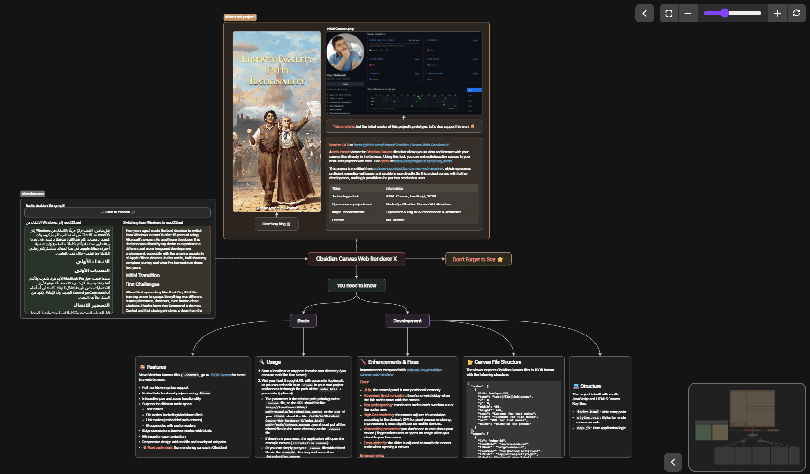

# JSON Canvas Viewer


[](https://www.npmjs.com/package/json-canvas-viewer)
[](https://packagephobia.now.sh/result?p=json-canvas-viewer)



A **TypeScript-based** viewer for **JSON Canvas** files. View and interact with your canvas files directly in the browser, or embed the viewer in front-end projects with ease. It is built without frameworks so it can be easily integrated into any framework.

This project is inspired by [sofanati-nour/obsidian-canvas-web-renderer](https://github.com/sofanati-nour/obsidian-canvas-web-renderer), but is far more developed and optimized.

For more about **JSON Canvas**, also known as **Obsidian Canvas**, please visit [jsoncanvas.org](https://jsoncanvas.org/).

## 📦 Installation

We recommend using your favorite package manager to install the package. **Note: This package requires `marked` as dependency, your package manager will automatically install it.**

```bash
# npm
npm install json-canvas-viewer

# pnpm
pnpm add json-canvas-viewer

# yarn
yarn add json-canvas-viewer
```

The integrated version is a choice if your project _doesn't use Node.js_, which is built with `marked` and `json-canvas-viewer` inlined so that it can be deployed in vanilla JavaScript projects. Find the integrated version in [Release page](https://github.com/hesprs/JSON-Canvas-Viewer/releases).

After installation, you can import the package as a module. It supports both ES module and CommonJS. JS, here we take ESM as an example:

```TypeScript
// with Node.js
import canvasViewer from 'json-canvas-viewer';

// using integrated version
import canvasViewer from 'path/to/canvasViewer.js';
```

## 🚀 Quick Start

As a custom element (a simple way to embed, already defined in the code):

```HTML
<canvas-viewer
    src="example/introduction.canvas"
    extensions="minimap mistouchPrevention"
    options="minimapCollapsed"
></canvas-viewer>
```

Or instantiate the viewer (more flexible, but requires more code):

```HTML
<div id="myCanvasContainer" style="width:800px; height:600px;"></div>
<script>
    const viewer = new canvasViewer(
 document.getElementById('myCanvasContainer'),
        ['minimap', 'mistouchPrevention'],
        ['minimapCollapsed']
    );
 viewer.loadCanvas('example/introduction.canvas');
 viewer.addEventListener('interact', e => {
        // handle node interaction
 });
    // dispose when not needed
 viewer.dispose();
</script>
```

**Tip**: All emitted events are realized by `JavaScript CustomEvent`, so the event callback is stored in `event.detail`.

If you are coding in TypeScript and intend to retrieve a Custom Event callback, please use the pattern below to make the type validator believe your code is type safe:

```TypeScript
const viewer: canvasViewer = new canvasViewer(...);
viewer.loadCanvas(...);
viewer.addEventListener('...', (e: Event) => {
    if (e instanceof CustomEvent) {
        // use e.detail safely here
        console.log(e.detail);
 };
});
```

## 🐶 Features

- View JSON Canvas files (`.canvas`) in a web browser
- Full markdown syntax support (auto-parsed to HTML)
- Embed into front-end projects using a container element or custom element
- Interactive pan and zoom functionality
- Support for different node types:
  - Text nodes
  - File nodes (including Markdown files)
  - Link nodes (embedded web content)
  - Group nodes with custom colors
- Edge connections between nodes with labels
- Minimap for easy navigation (optional extension)
- Mistouch prevention (optional extension)
- Responsive design with mobile and touchpad adaptation
- 🔥 **Much more performant** than rendering canvases in Obsidian!

## 🔌 API Reference

### Constructor

```TypeScript
new canvasViewer(container, extensions, options);
```

- `container`: HTMLElement where the viewer will be rendered
- `extensions`: (optional) Array (or space-separated string in case of custom element) of extension names to enable:
  - `minimap` - Adds navigation minimap
  - `mistouchPrevention` - Freezes canvas when clicking outside. **Warning: navigation methods (like `zoomIn()` or `resetView()`) cannot take effect if the canvas is frozen**.
- `options`: (optional) Array (or space-separated string in case of custom element) of config options:
  - `controlsHidden` - Hides the control panel
  - `controlsCollapsed` - Starts with controls collapsed
  - `proControlSchema` - Uses control keybindings in professional software (`mouse wheel`: scroll vertically; `mouse wheel` + `shift`: scroll horizontally; `mouse wheel` + `ctrl`: zoom), rather than zooming with the mouse wheel. The canvas viewer automatically detects and adjusts the control schema by default, but you can explicitly configure it. This option doesn't affect mobile control.
  - `noShadow` - Disables shadow DOM, DOM elements will be appended to the light DOM directly. The canvas viewer will still be functional, but the styles may be affected.
  - `noPreventionAtStart` (available when mistouchPrevention is enabled) Starts without prevention
  - `minimapCollapsed` - (available when minimap is enabled) Starts with minimap collapsed

### Methods

- `loadCanvas(path)` — Load a canvas file (by path), **please put all the related files (files embedded in the canvas) in the same folder as the canvas file, wherever they originally are**.
- `shiftFullscreen(option)` — Toggle fullscreen mode ('toggle', 'enter', 'exit')
- `resetView()` — Reset pan/zoom to fit canvas content
- `zoomIn()` — Zoom in by a fixed step
- `zoomOut()` — Zoom out by a fixed step
- `setScale(scale)` — Set zoom level to a specific value (number, 0.05–20)
- `panTo(x, y)` — Pan the view to a specific world coordinate
- `dispose()` — Clean up and remove viewer from DOM

### Events

Register with `viewer.addEventListener(event, callback)`.

- `interact` — Fired when a node is interacted with (`callback(node id, type: 'select' | 'preview')`)
- `loaded` — Fired when a canvas file is loaded (`callback(canvasData)`)

## 📂 Canvas File Structure

The viewer expects JSON Canvas files in JSON format:

```JSON
{
    "nodes": [
        {
            "id": "unique-id",
            "type": "text|file|link|group",
            "x": 0,
            "y": 0,
            "width": 400,
            "height": 400,
            "text": "Content for text nodes",
            "file": "filename for file nodes",
            "url": "URL for link nodes",
            "color": "color-id for groups"
        }
    ],
    "edges": [
        {
            "id": "edge-id",
            "fromNode": "source-node-id",
            "toNode": "target-node-id",
            "fromSide": "top|bottom|left|right",
            "toSide": "top|bottom|left|right",
            "label": "Optional edge label"
        }
    ]
}
```

## 💻 Development

Built with `TypeScript`, `SCSS` and `HTML5 Canvas`.

**Project Structure**:

```bash
root
├── src/
│   ├── canvasViewer.ts        // Main class-based component
│   ├── controls.ts            // Controls panel
│   ├── interactor.ts          // Handles pointer events for user pan/zoom
│   ├── minimap.ts             // Minimap extension
│   ├── mistouchPreventer.ts   // MistouchPrevention extension
│   ├── overlayManager.ts      // Renderer for interactive nodes
│   ├── previewModal.ts        // Preview modal
│   ├── renderer.ts            // Renderer for non-interactive stuff + some shared exports
│   ├── declarations.d.ts      // Public types
│   └── styles.scss            // Styles for the viewer
└── example/
 └── index.html                // Example/test entry point
```

**Development Standards**:

- Strict type validation, no non-null assertion operator `!` allowed.
- Meticulous resource disposal, no memory leak ever possible.
- Modularized components, avoid monolithic classes.

**Extensibility**:

You can extend `Marked` to support more markdown features. Please include `marked` as a dependency, and all [extensions based on Marked](https://marked.js.org/using_pro) are applied equally to the viewer.

## 📝 Copyright & License

Copyright ©️ 2025 Hesprs (Hēsperus) | [MIT License](https://mit-license.org/)
