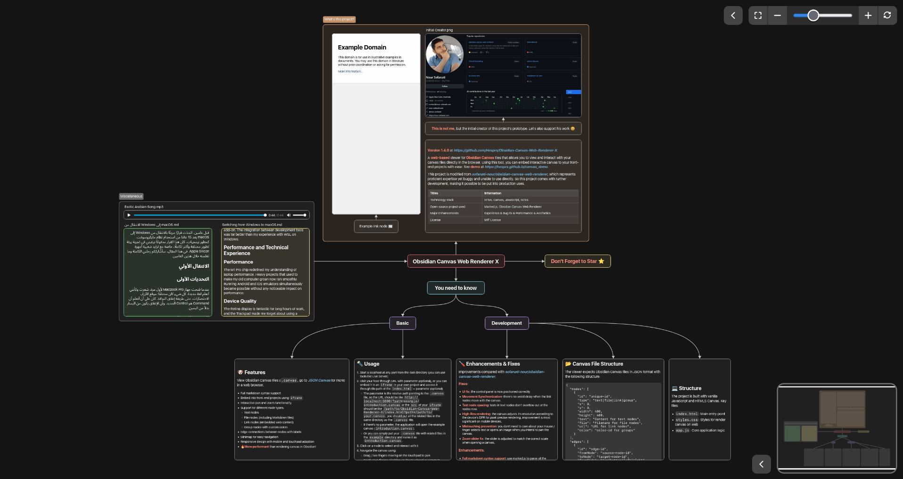

# JSON Canvas Viewer

[](https://www.npmjs.com/package/json-canvas-viewer)
[](https://bundlephobia.com/package/json-canvas-viewer)
[](https://github.com/hesprs/json-canvas-viewer/actions)
[](https://www.codefactor.io/repository/github/hesprs/json-canvas-viewer)

[](https://snyk.io/test/npm/json-canvas-viewer)



A **TypeScript-based** viewer for **JSON Canvas** files. View and interact with your canvas files directly in the browser, or embed the viewer in front-end projects with ease. It is built without frameworks so it can be easily integrated into any framework.

This project is inspired by [sofanati-nour/obsidian-canvas-web-renderer](https://github.com/sofanati-nour/obsidian-canvas-web-renderer), but is far more developed and optimized.

For more about **JSON Canvas**, also known as **Obsidian Canvas**, please visit [jsoncanvas.org](https://jsoncanvas.org/).

## 📦 Installation

We recommend using your favorite package manager to install the package. **Note: This package requires `marked` as dependency, your package manager will automatically install it.**

```bash
# npm
npm install json-canvas-viewer

# pnpm
pnpm add json-canvas-viewer

# yarn
yarn add json-canvas-viewer
```

After installation, you can import the package as a module. It supports both ES module and CommonJS. JS, here we take ESM as an example:

```TypeScript
import canvasViewer from 'json-canvas-viewer';
```

## 🚀 Quick Start

Instantiate the viewer:

```HTML
<div id="myCanvasContainer" style="width:800px; height:600px;"></div>
<script type="module">
    import canvasViewer from 'json-canvas-viewer';
    import minimap from 'json-canvas-viewer/minimap'

    const viewer = new canvasViewer(document.getElementById('myCanvasContainer'), {
		extensions: [minimap], // use extensions
		options: {
			minimap: {
				collapsed: true, // use options
			},
		},
        hooks: {
            onLoad: [(path) => console.log(`Loading Canvas at ${path}!`)] // register hooks
        }
	});
    viewer.loadCanvas('example/introduction.canvas');

    console.log(viewer.registry.api.dataManager.middleViewer()); // use APIs

    viewer.dispose(); // dispose when not needed
</script>
```

And the viewer should be right in your container, you can instantiate the viewer multiple times to render multiple canvases simultaneously.

**Public Methods & Registry**:

- `viewer.loadCanvas(path)` - Load a canvas file (by path), **please put all the related files (files embedded in the canvas) in the same folder as the canvas file, wherever they originally are**.
- `viewer.dispose()` - Clean up and remove viewer from DOM.
- `viewer.registry` - access `registry` (covered later).


## 🐶 Features

- View JSON Canvas files (`.canvas`) in a web browser
- Full markdown syntax support (auto-parsed to HTML)
- Embed into websites easily
- Interactive pan and zoom functionality
- Support for different node types:
  - Text nodes
  - File nodes (including Markdown files)
  - Link nodes (embedded web content)
  - Group nodes with custom colors
- Edge connections between nodes with labels
- Minimap for easy navigation (optional extension)
- Mistouch prevention (optional extension)
- Responsive design with mobile and touchpad adaptation
- Out-of-the-box extensibility and tree-shaking
- TypeScript native support
- 🔥 **Much more performant** than rendering canvases in Obsidian!

## 🧩 Extensibility

### Registry

The viewer implements the `registry`, which is a powerful orchestrator to streamline the development and extension of the viewer. The registry is the core of the viewer.

```TypeScript
new canvasViewer(container, registry);

interface registry {
    options: Record<string, Record<string, any>>;
    extensions: Array<Class<runtimeData, registry>>;
    hooks: Record<string, Array<Function>>;
    api: Record<string, Record<string, Function>>;
    register: (userRegistry: userRegistry) => void;
}
interface Class<T> { new (...args: any[]): T }
interface Function { (...args: any[]): any }
```

The second parameter of the constructor is an object which is then merged with the default registry. You can also manually register using the `registry.register` method.

**Default Options and Values**:

```TypeScript
registry: {
    options: {
        main: {
            noShadow: false,
        },
        interactor: {
            preventDefault: true,
            proControlSchema: false,
            zoomFactor: 0.002,
            lockControlSchema: false,
	    },
    }
}
```

- `noShadow` — Disables shadow DOM, DOM elements will be appended to the light DOM directly. The canvas viewer will still be functional, but the styles may be affected.
- `preventDefault` — Prevents default behavior of mouse events, the viewer may not work properly if set to false.
- `proControlSchema` — Uses control keybindings in professional software (`mouse wheel`: scroll vertically; `mouse wheel + shift`: scroll horizontally; `mouse wheel + ctrl`: zoom), rather than zooming with the mouse wheel. The canvas viewer automatically detects and adjusts the control schema by default, but you can explicitly configure it. This option doesn't affect mobile control.
- `zoomFactor` — The zoom factor, how fast the canvas zooms in or out.
- `lockControlSchema` — Locks the control schema.

**Default Hooks**:

```TypeScript
registry: {
    hooks: {
        onDispose: [],
        onRender: [],
        onResize: [(width: number, height: number) => {}],
        onClick: [(id: string | null) => {}],
        onToggleFullscreen: [],
        onInteractionStart: [],
        onInteractionEnd: [],
    }
}
```

- `onDispose` — Called when the viewer is disposed.
- `onRender` — Called when the viewer is rendered every frame.
- `onResize` — Called when the viewer container is resized.
  - `width` — The width of the resized viewer container.
  - `height` — The height of the resized viewer container.
- `onClick` — Called when the canvas is clicked.
  - `id` — The id of the node that is clicked, or `null` if no node is clicked.
- `onToggleFullscreen` — Called when the fullscreen mode is toggled.
- `onInteractionStart` — Called when the pointer enters a selected node.
- `onInteractionEnd` — Called when the pointer leaves a selected node.

**Default API**:

```TypeScript
registry: {
    api: {
        main: {
            loadCanvas: (path: string) => Promise<void>,
            refresh: () => void,
            pan: (x: number, y: number) => void,
            zoom: (factor: number, origin: Coordinates) => void,
            zoomToScale: (newScale: number, origin: Coordinates) => void,
            panToCoords: (x: number, y: number) => void,
            shiftFullscreen: (option: 'toggle' | 'enter' | 'exit' = 'toggle') => void,
            resetView: () => void,
        },
        dataManager: {
            middleViewer: () => {
                x: number;
                y: number;
                width: number;
                height: number;
            },
            findNodeAt: (mousePosition: Coordinates) => JSONCanvasNode | null,
            applyStyles: (container: HTMLElement, styleString: string) => void,
        },
        interactionHandler: {
            stop: () => void,
            start: () => void,
        },
    }
}
```

- `main.loadCanvas` - Same as viewer.loadCanvas.
- `main.refresh` - Manually trigger a render.
- `main.pan` - Pan the canvas by x and y distance.
- `main.zoom` - Zoom the canvas by a factor.
- `main.zoomToScale` - Zoom to a specific scale.
- `main.panToCoords` - Pan to a specific coordinate (word coordinate).
- `main.shiftFullscreen` - Enter/exit fullscreen.
- `main.resetView` - Reset the scale and offset to default that the whole canvas is visible.
- `dataManager.middleViewer` - Returns the dimensions of the viewer container element.
  - `x` - Half of the container width.
  - `y` - Half of the container height.
  - `width` - Container width.
  - `height` - Container height.
- `dataManager.findNodeAt` - Find the node at the given position (word coordinate).
- `dataManager.applyStyles` - Add a `<style>` element containing styleString to container (used in extension development).
- `interactionHandler.stop` - Stop receiving pan/zoom/click interaction.
- `interactionHandler.start` - Start receiving pan/zoom/click interaction.

### Extensions

The viewer is built with extensibility in mind, and it is easy to extend the viewer with custom extensions.

#### Official Extensions

**minimap**: Renders the minimap with an overview of the canvas.
  - used with:
    ```TypeScript
    import minimap from 'json-canvas-viewer/minimap';
    new canvasViewer(container, { extensions: [minimap] });
    ```
  - new options and API:
    ```TypeScript
    {
        options: {
            minimap: {
                collapsed: false,
            },
        },
        api: {
            minimap: {
                toggleCollapse: () => void,
            },
        }
    }
    ```

**mistouchPreventer**: Prevents mistouch by freezing the canvas when clicking outside the viewer.
  - used with:
    ```TypeScript
    import mistouchPreventer from 'json-canvas-viewer/mistouchPreventer';
    new canvasViewer(container, { extensions: [mistouchPreventer] });
    ```
  - new options and API:
    ```TypeScript
    {
        options: {
            mistouchPreventer: {
                preventAtStart: true,
            },
        },
        api: {
            mistouchPreventer: {
                startPrevention: () => void,
                endPrevention: () => void,
            },
        }
    }
    ```

**controls**: Shows a control bar with zoom, pan, scale slider, and fullscreen buttons.
  - used with:
    ```TypeScript
    import controls from 'json-canvas-viewer/controls';
    new canvasViewer(container, { extensions: [controls] });
    ```
  - new options and API:
    ```TypeScript
    {
        options: {
            controls: {
                collapsed: false,
            },
        },
        api: {
            controls: {
                toggleCollapse: () => void,
            },
        }
    }
    ```

**debugPanel**: Shows a debug panel with scale and offset.
  - used with:
    ```TypeScript
    import debugPanel from 'json-canvas-viewer/debugPanel';
    new canvasViewer(container, { extensions: [debugPanel] });
    ```
  - new API:
    ```TypeScript
    {
        api: {
            debugPanel: {
                update: () => void,
            },
        }
    }
    ```

#### Develop an Extension

An extension, in essence, is a class that follows a fixed pattern. You can do almost anything with the viewer by using an extension. Actually, the viewer runs with only four core extensions: `renderer`, `interactionHandler`, `overlayManager` and `dataManager`. Here is the fixed pattern:
- receive `runtimeData` and `registry` as parameters in the constructor.
- calls `registry.register` first in the constructor to define default options, register hooks and provide API.

**Runtime Data**:

```TypeScript
interface runtimeData {
    offsetX: number;
    offsetY: number;
    scale: number;
    canvasData: JSONCanvas;
    nodeMap: Record<string, JSONCanvasNode>;
    canvasBaseDir: string;
    nodeBounds: nodeBounds;
    container: HTMLDivElement;
}

interface nodeBounds {
    minX: number;
    minY: number;
    maxX: number;
    maxY: number;
    width: number;
    height: number;
    centerX: number;
    centerY: number;
}
```

- `offsetX` - The x offset of the canvas in viewport (word coordinate).
- `offsetY` - The y offset of the canvas in viewport (word coordinate).
- `scale` - The scale of the canvas in viewport.
- `canvasData` - The canvas data (see § Canvas File Structure).
- `nodeMap` - Remap canvas nodes with their ids.
- `canvasBaseDir` - The base directory of the canvas file.
- `nodeBounds` - The bounds of all the canvas nodes (word coordinate).
- `container` - The container of the canvas.

**Example**:

Here comes a minimal sample extension of a debug panel (JavaScript for simplicity):

```JavaScript
import style from './style.scss?inline';

export default class debugPanel {
    constructor(data, registry) {
        registry.register({
            hooks: {
                onRender: [this.update],
                onDispose: [this.dispose],
            },
            api: {
                debugPanel: {
                    update: this.update,
                },
            },
        });
        this.debugPanel = document.createElement('div');
        this.debugPanel.className = 'debug-panel';
        registry.api.dataManager.applyStyles(this.debugPanel, style);
        this.data = data;
        data.container.appendChild(this.debugPanel);
    }

    private update = () => {
        this.debugPanel.innerHTML = `
            <p>Scale: ${round(this.data.scale, 3)}</p>
            <p>Offset: ${round(this.data.offsetX, 1)}, ${round(this.data.offsetY, 1)}</p>
        `;
    };

    private round = (roundedNum, digits) => {
	    const factor = 10 ** digits;
	    return Math.round(roundedNum * factor) / factor;
    }

    private dispose = () => {
        this.debugPanel.remove();
        this.debugPanel = null;
    };
}
```

## 💻 Development

Built with `TypeScript`, `SCSS` and `HTML5 Canvas`.

**Project Structure**:

```
root
├── src/
│   ├── extensions/
│   │   ├── controls/              // Control panel
│   │   ├── minimap/               // Minimap extension
│   │   ├── mistouchPreventer/     // MistouchPrevention extension
│   │   └── debugPanel/            // Debug panel
│   ├── canvasViewer.ts            // Main entry point
│   ├── interactor.ts              // Handles pointer events for user pan/zoom
│   ├── dataManager.ts             // Manages canvas data
│   ├── interactionHandler.ts      // Handles interaction events (wrapper of interactor)
│   ├── overlayManager.ts          // Renderer for interactive nodes
│   ├── renderer.ts                // Renderer for non-interactive stuff
│   ├── declarations.d.ts          // Public types
│   ├── utilities.ts               // Utility functions
│   └── styles.scss                // Main styles for the viewer
└── example/
    ├── index.html                 // Example/test entry point
    └── Example Canvas/            // Example/test canvas folder
```

**Canvas File Structure**:

The viewer expects JSON Canvas files in JSON format (a combination of official [JSON Canvas](https://jsoncanvas.org/spec/1.0/) spec and [Developer-Mike/obsidian-advanced-canvas](https://github.com/Developer-Mike/obsidian-advanced-canvas) spec):

```TypeScript
interface JSONCanvas {
    nodes: Array<JSONCanvasNode>;
    edges: Array<JSONCanvasEdge>;
    metadata: {
        version: string;
        frontmatter: Record<string, string>;
    };
}

interface JSONCanvasNode {
    id: string;
    type: 'group' | 'file' | 'text' | 'link';
    x: number;
    y: number;
    width: number;
    height: number;
    label?: string;
    background?: string;
    backgroundStyle?: 'cover' | 'ratio' | 'repeat';
    styleAttributes?: Record<string, string>;
    color?: string;
    text?: string;
    file?: string;
    subpath?: string;
    url?: string;
}

interface JSONCanvasEdge {
    id: string;
    fromNode: string;
    toNode: string;
    fromSide: 'right' | 'left' | 'top' | 'bottom';
    toSide: 'right' | 'left' | 'top' | 'bottom';
    toEnd?: 'arrow' | 'none';
    label?: string;
    styleAttributes?: Record<string, string>;
    color?: string;
}
```

## 📝 Copyright & License

Copyright ©️ 2025 Hesprs (Hēsperus) | [MIT License](https://mit-license.org/)
